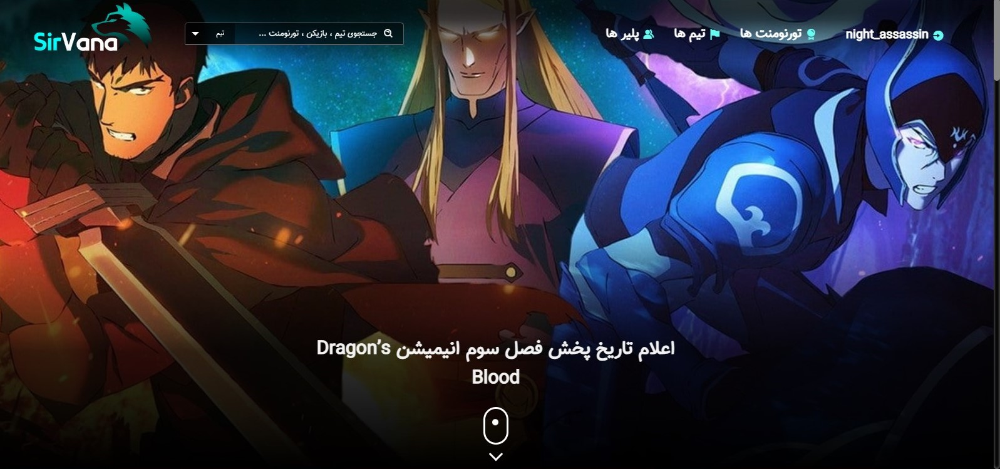
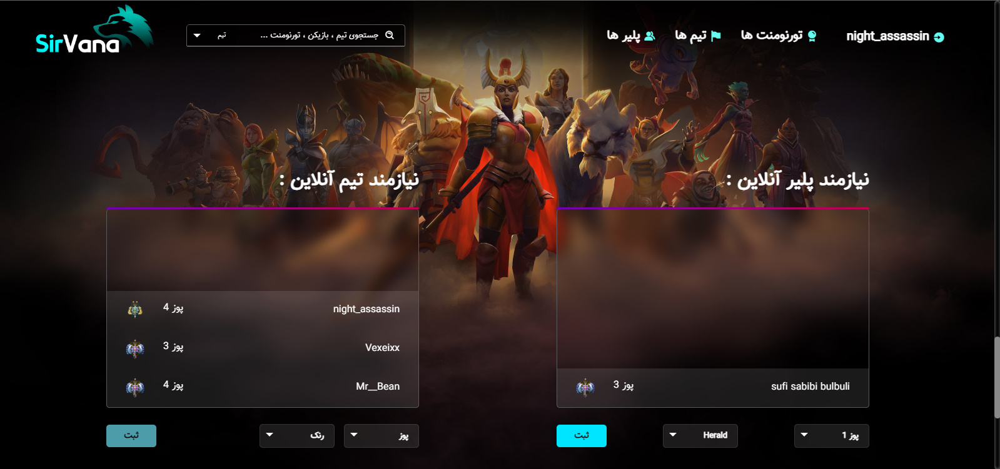
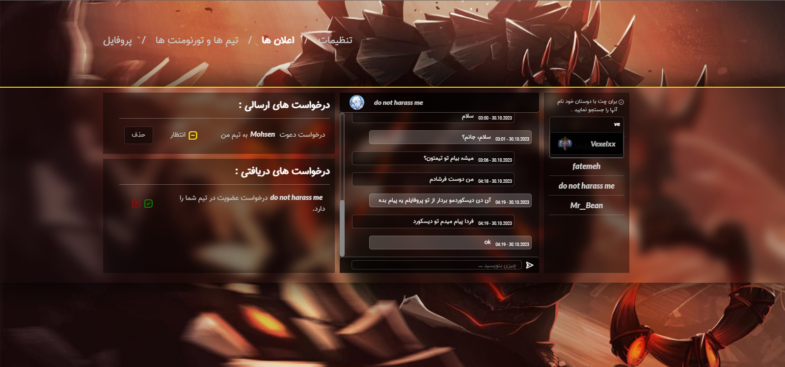
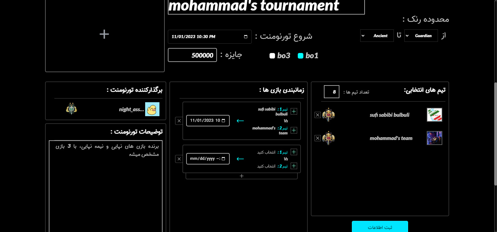
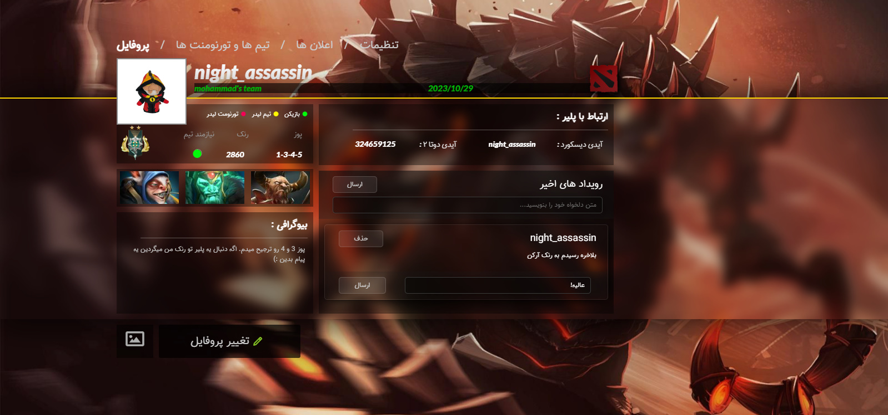

<div align="center">
    <h1><b>SirVana</b></h1>
</div>



_A website for dota2 players to create create and find teams, communicate with eachother, create and join tournaments with their team._

### Link to Website: [Live Page](https://sirvana.iran.liara.run/)

### Installation

#### `Step 1` - clone the repo

```bash
$ git clone https://github.com/mohammadKhazaee/SirVana.git
```

#### `Step 2` - cd in the repo

```bash
$ cd SirVana
```

#### `Step 3` - install dependencies

```bash
$ npm install
```

#### `Step 4 (Optional)` - set environment variables (if you wanna test email features)

- EMAIL (email which app will emails with)
- OAUTH_CLIENT_ID
- OAUTH_CLIENT_SECRET
- OAUTH_REFRESH_TOKEN

> _For more info about accessing to OAuth credentials go [here](https://masashi-k.blogspot.com/2013/06/sending-mail-with-gmail-using-xoauth2.html)_

```bash
$ code .env
```

#### `Step 5` - run application

```bash
$ npm start
```

In browser, open [http://localhost:3000](http://localhost:3000)

## Main Features

- [x] - Looking For Team or Player Message Box (using socket.io)
    
- [x] - Live AJAX Search for teams, players & tournament

- [x] - Managing Incomming Requests, Keep Track of Sent Requests & Real Time Private Chat
    

- [x] - Tournament Organizers Can Schedule Games
    

- [x] - Share Feeds With Other Users In Profile
    

#### License

MIT © [mohammadKhazaee](https://github.com/mohammadKhazaee)

## Contributors

- Back-End Developer @mohammadKhazaee
- Front-End Developer @fshd1-front

<div align="center">
  <sub>If you found a bug or some improvments, feel free to raise an issue and send a PR!</sub>
</div>
